[comment]: # "This is the standard layout for the project, but you can clean this and use your own template"

# Greenhouse Monitoring System Based on Image Spectral Data

---

## Table of Contents
1. [Introduction](#introduction)
2. [Problem Statement](#problem-statement)
3. [Solution](#solution)
4. [Links](#links)

---

## Introduction

Greenhouse Monitoring System provides a platform to manage the Greenhouse by tracking the phases of plant harvest, identifying any plant disorder and tracking the plant growth by using the image spectral data of plants. The system is basically considered the key problems plant diseases, huge harvest wastage and unnecessary expensive maintenance in a greenhouse. So this system will make a high positive impact on maximizing the harvest and reduce maintenance cost in Greenhouses.

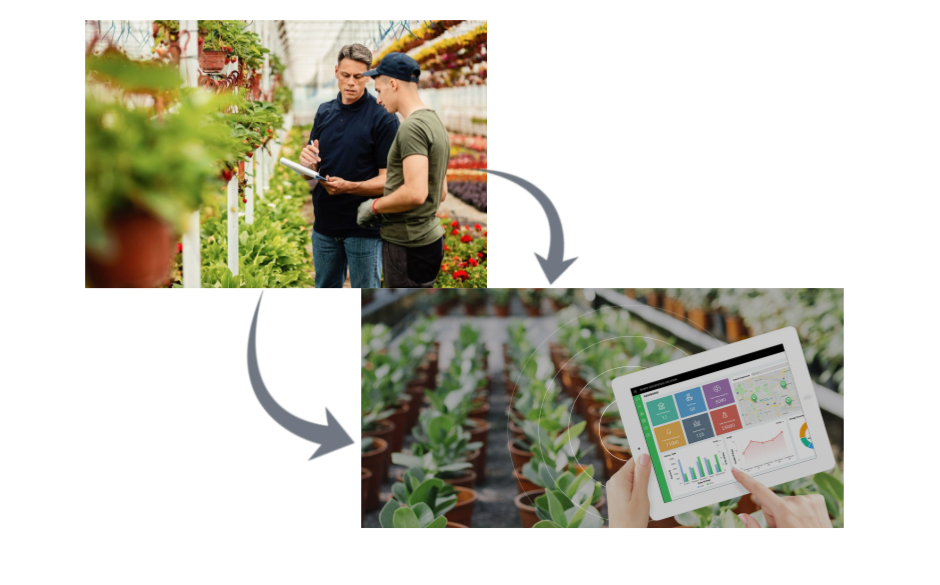

## Problem Statement
- Different behaviors of plants under different conditions
- Various disorders of plants
- Taking manual measurements of information of the plants
- Inefficiency of labor system
- Unnecessary higher cost for maintenance

Although the environmental conditions of plants are controlled, the temporal effects like temperature, humidity may not evenly balanced for each crop. Therefore, plants respond differently under those unbalanced environmental conditions. And, plants can have different kind of disorders. It leads to production failures in greenhouses. As well, the crop yield may not be harvested at the right moment. Because of that there would be a huge harvest wastage.

In current greenhouses, the workers continuously observe the plant growth. In that case, workers will be tired and labor system would be inefficient. So, there would be an unnecessary higher cost for maintenance.

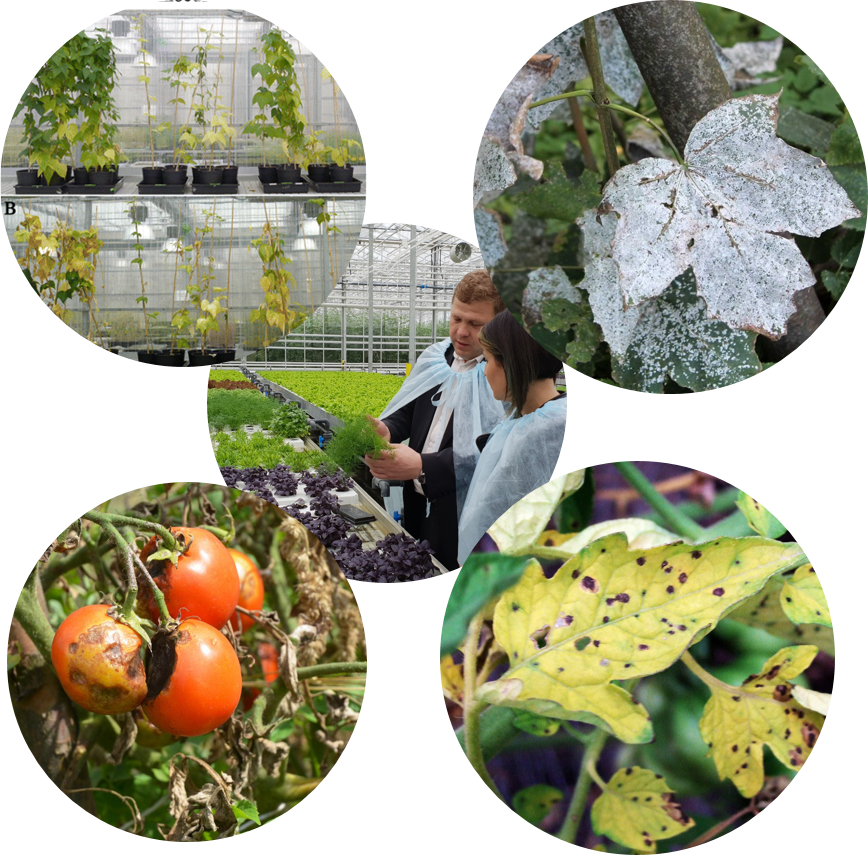

## Solution
Plant diseases, huge harvest wastage and unnecessary expensive maintenance have been observed as the major issues in current Greenhouse Systems. These key problems simulated the development of image analysis and computer vision methods. That's how the "greenhouse monitoring system based on image spectral data" came to the stage.

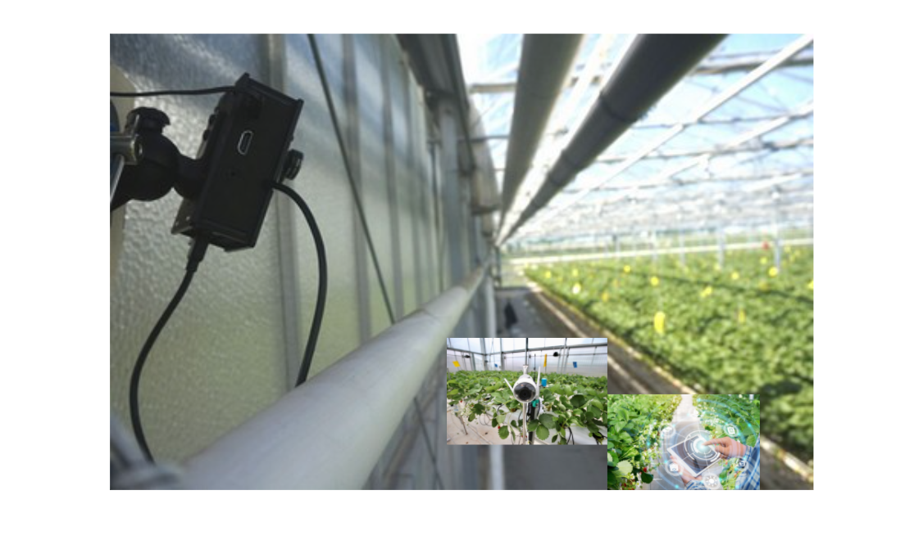

## Solution Architecture
Functionalities of the system
1. Extract images from the video file.
2. Extract features from images.
3. Store those images and features in a database.
4. Data processing and data analysis using ML Model
5. Data Visualization
6. Data Prediction and generate reports

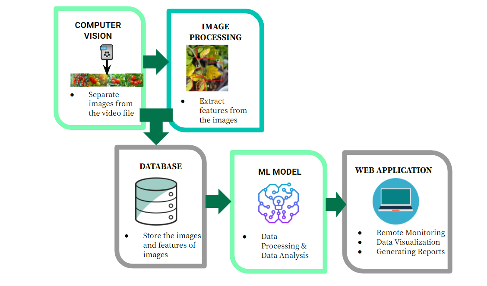

## System Modelling

### Functional Requirements
- System updates per one hour with new plants images according to the given video file.
- Monitor the diseases, crop harvest and growth plant by plant.
- When displaying the features of the system, user should be able to select plant according to their labels.
- If any error occurred in the system, it should be displayed as an alert.
- When the crop should be harvest at the moment, user should be notified it.
- Monitor the future greenhouse status of the features.
- Reports should be generated and they should be able to download.

### Non-Functional Requirements
- Interfaces should be user friendly.
- Performance with response time should be efficient.
- The System Predictions of the Machine Learning Model shoud be reliable.
- The security of the system should be high.
- In the future according to new requirements, system should be scalable from features and performance.

### Use Case Diagram
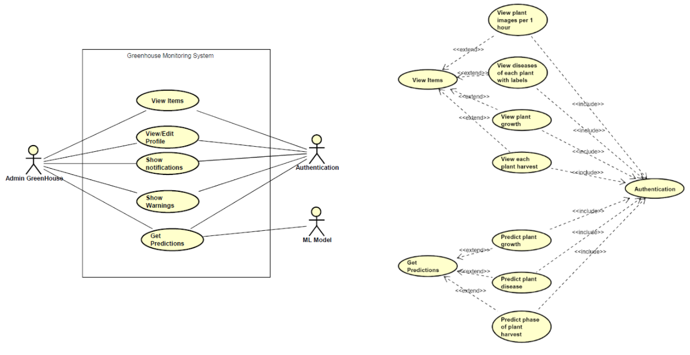

## Software Design
### User's Application Data Flow
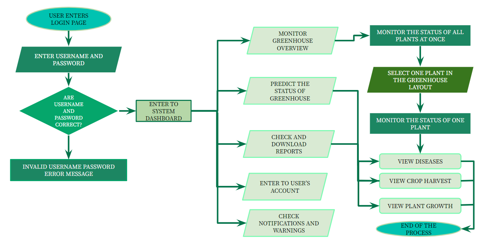

### User Interfaces
1. Login
- Greenhouse workers can login to the system by entering username and password.

2. Dashboard
- User can monitor the overall status of greenhouse.
- User can see what plants have problems in the greenhouse layout panel. and if user clicks the layout it will navigate to the Overview User Interface.
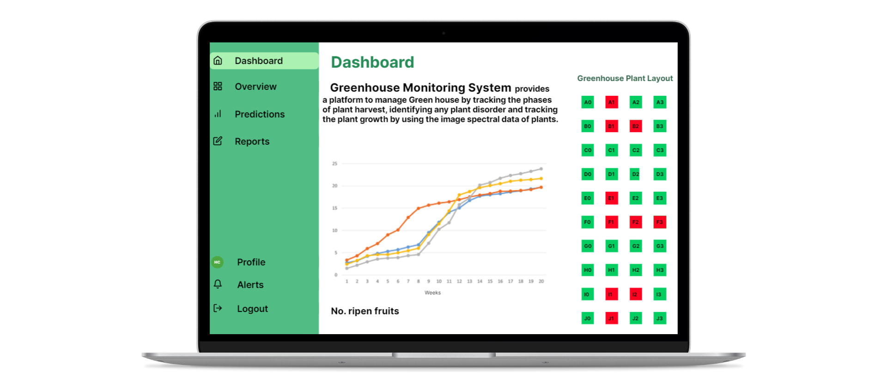

3. Overview
- User can monitor all plants at once.
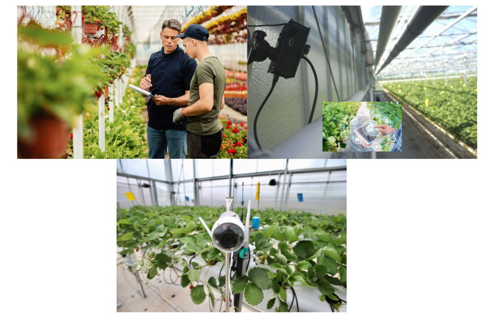

4. One Plant Overview
- User can monitor only one plant.
- If user needs to see the diseases, growth and harvest status of that plant, he can click those options in the user interface.
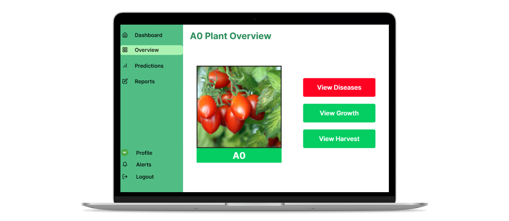

5. Leaf Diseases
- If the plant has any disease it will be shown in this interface.

6. Plant Growth
- The plant growth can be monitored here.
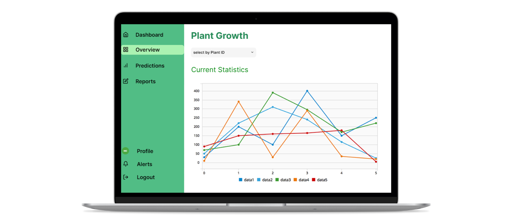

7. Crop Harvest
- The plant harvest status can be seen here.
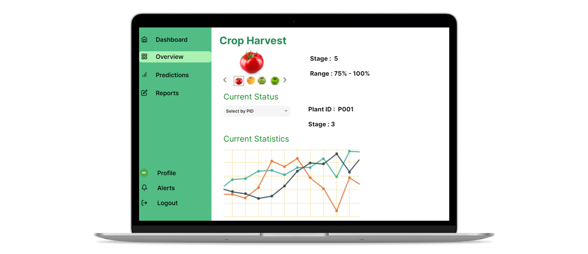

8. Predictions
- The predictions of diseases, growth, harvest of each plant can be monitored here.
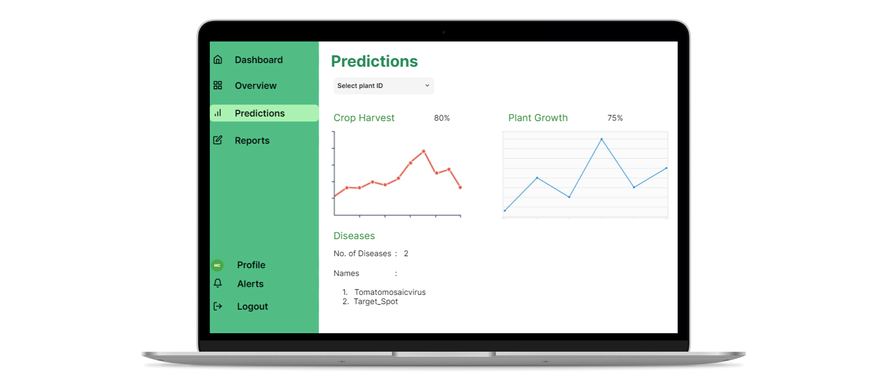

9. Reports
- The reports of the greenhouse system status can be seen and downloaded from here.
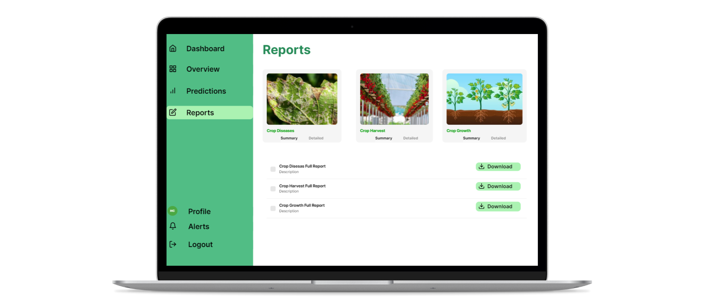

## Machine Learning Model
- The main target of ML model is to predict the specific two features for a given time period.
- The features are crop harvest stage and leaf diseases.

### Leaf Diseases Detection
- We define 10 different kinds of leaf diseases.
  - Tomatomosaicvirus
  - Target_Spot
  - Bacterial_spot
  - TomatoYellowLeafCurlVirus
  - Late_blight
  - Leaf_Mold
  - Early_blight
  - Spidermites Two-spottedspider_mite
  - Tomato___healthy
  - Septorialeafspot

#### Leaf DIseases Model Architecture
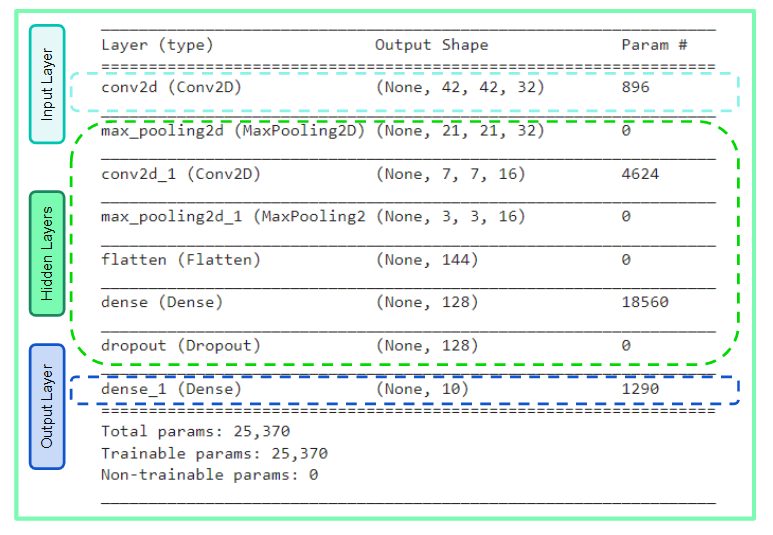

### Crop Harvest Stage Prediction
- Separate fruits from the given images.
- Detect Average color
- Predict the crop harvest stage and count number of fruits according to the color bar.

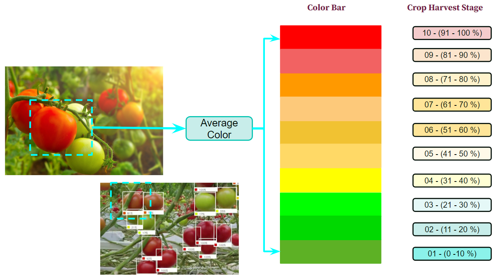

### Test Results
#### Leaf Diseases Model
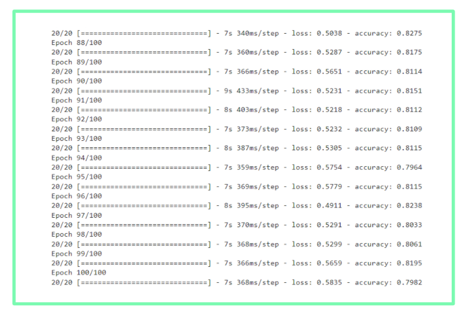

## Team
-  E/17/297, Rupasinghe T.T.V.N., [e17297@eng.pdn.ac.lk](mailto:e17297@eng.pdn.ac.lk)
-  E/17/206, Manohara H.T., [e17206@eng.pdn.ac.lk](mailto:e17206@eng.pdn.ac.lk)
-  E/17/148, Kalpana M. W. V., [e17148@eng.pdn.ac.lk](mailto:e17148@eng.pdn.ac.lk)

## Links

- [Project Repository](https://github.com/cepdnaclk/e17-co328-Greenhouse-Monitoring-System/{{ page.repository-name }}){:target="_blank"}
- [Project Page](https://cepdnaclk.github.io/e17-co328-Greenhouse-Monitoring-System/{{ page.repository-name}}){:target="_blank"}
- [Department of Computer Engineering](http://www.ce.pdn.ac.lk/)
- [University of Peradeniya](https://eng.pdn.ac.lk/)

[//]: # (Please refer this to learn more about Markdown syntax)
[//]: # (https://github.com/adam-p/markdown-here/wiki/Markdown-Cheatsheet)
